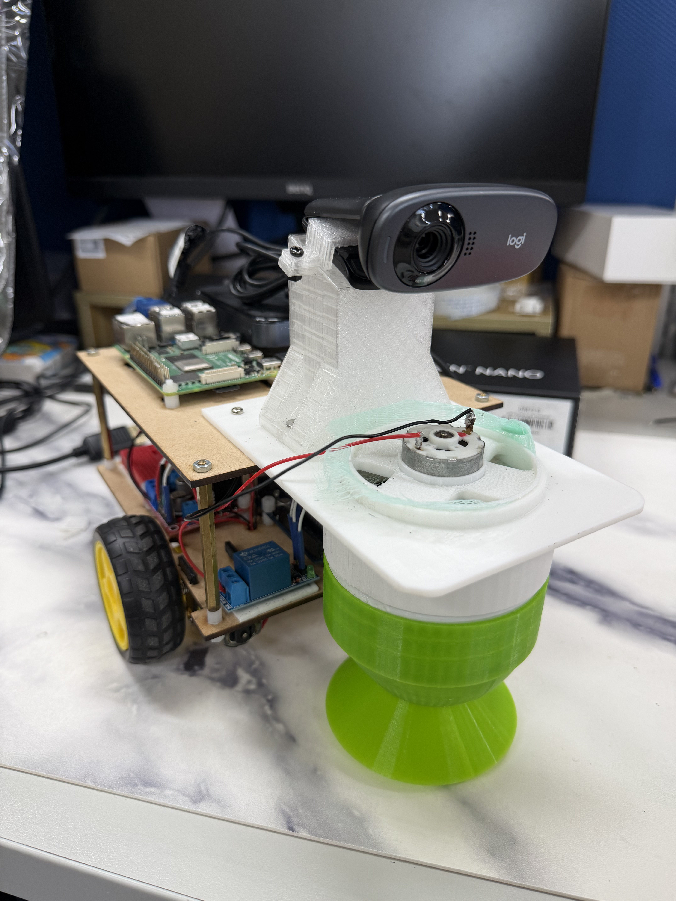

# 🏎️ Raspberry Pi Web-Controlled Robot (MQTT + WebSocket + Video Stream)
# 使用 RPi 打造的網頁遙控機器人（含影像串流）
A **web-controlled robot** powered by **Raspberry Pi**, **MQTT**, **WebSocket**, and **Arduino**,  
featuring **real-time video streaming**, a **virtual joystick**, and a **vacuum control system**.

透過瀏覽器即可同時：
- 📷 觀看即時影像（由 `mjpg-streamer` 提供）
- 🎮 使用虛擬搖桿控制機器人行進方向
- 🧹 遠端開關吸塵模組（或其他外接裝置）

> 技術架構：Browser ⇄ WebSocket ⇄ MQTT ⇄ Raspberry Pi ⇄ Arduino

詳細設定請看 Notion 內容：
- [Project Notes on Notion](https://www.notion.so/27589de4c16a8042908ce911cd3175cb?source=copy_link)

Demo 影片：
- [YouTube Shorts](https://youtube.com/shorts/Qz88FasbGkQ?si=obFcgvtguyaGCXYy)
- [YouTube Shorts](https://youtube.com/shorts/qHWO3xdQ8QE?si=1RvgfOgJcg2i2Dtj)

---

## Features

- **WebSocket + MQTT Bridge** — 即時雙向控制通訊
- **mjpg-streamer Video Stream** — 提供 HTTP/MJPEG 即時影像
- **Virtual Joystick Interface** — 前端網頁操控馬達 PWM
- **Vacuum Control System** — 前端開關吸塵裝置
- **Arduino + L298N Motor Driver** — 控制左右輪與繼電器
- **Systemd Services** — 自動啟動 MQTT Broker / Bridge / Stream / HTML Server

---

## System Architecture

**整體資料流：**

```text
Browser (HTML control page)
   ⇅ WebSocket (ws://<RPi-IP>:8081)
WebSocket ↔ MQTT Bridge (Node.js)
   ⇅ MQTT Broker (Mosquitto on :1883)
Python Controller (MQTT → Serial)
   ⇅ USB Serial
Arduino (L298N + Vacuum relay)
```
```text
USB Camera → mjpg-streamer (HTTP on :8080) → 
```

---

## Repository Structure
```text
rpi-web-robot-control/
├── rpi/                            # RPi端程式碼
│   ├── ws-mqtt-bridge/
│   │   ├── package.json            # Node.js 專案設定與依賴套件清單
│   │   └── bridge.js               # Bridge 主程式，將 WebSocket 與 MQTT 雙向轉換
│   ├── html/
│   │   └── mqtt_test.html          # 前端控制頁（搖桿 + 影像 + 吸塵控制）
│   ├── python/
│   │   └── RobotCtrl_Arduino.py    # 透過 MQTT 接收指令並經 Serial 發送給 Arduino
│   └── systemd/                    
│       ├── ws-mqtt-bridge.service  # 開機自啟動 Node.js 橋接服務
│       ├── mjpg-streamer.service   # 開機自啟動影像串流服務
│       └── html-server.service     # 開機自啟動靜態控制頁 HTTP 伺服器
|
├── arduino/                        # Arduino端程式碼
│   └── RobotCtrl_Arduino.ino       # L298N + 繼電器控制程式
│    
│── images/
│   └── robot.jpg                   # 機器人照片
│       
├── README.md                       # 專案說明文件（本檔案）
└── LICENSE                         # MIT 授權
```
---
## Robot Image 


